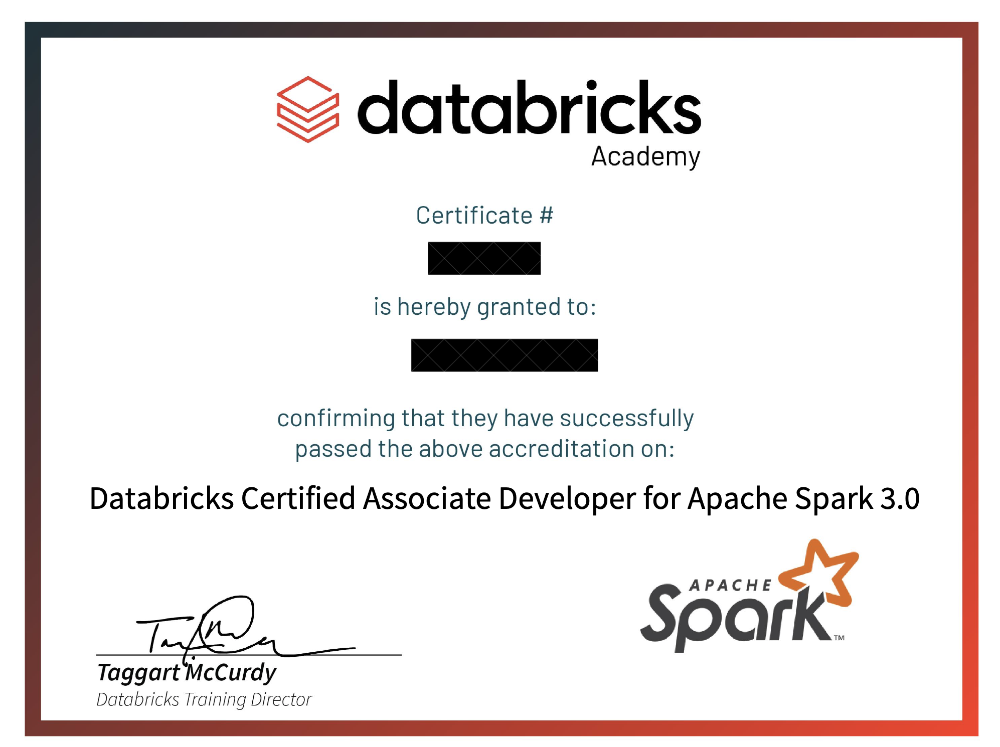
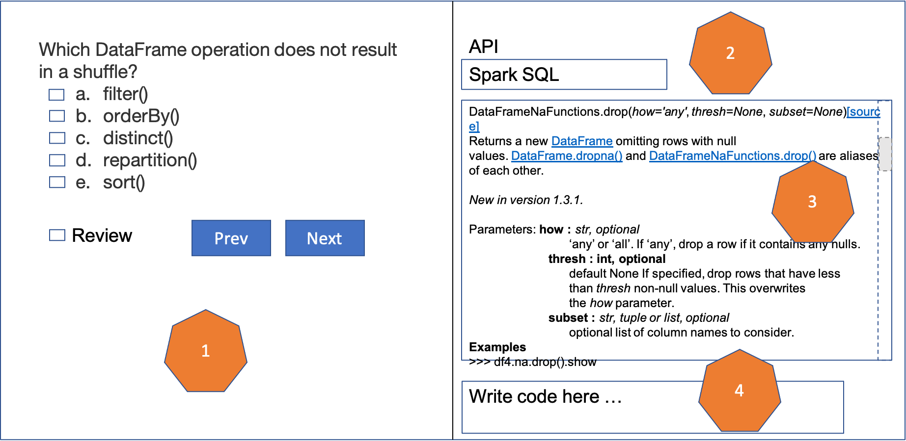
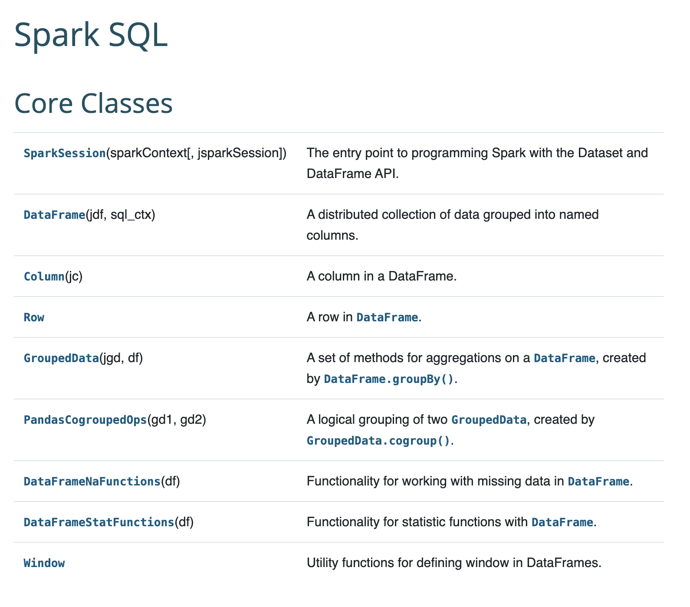

# Databricks Certified Associate Developer for Apache Spark 3.0: How to?

I work with Apache Spark on a regular basis. I decided to formalize my know-how on the language by taking a certification. At the time of writing, Databricks is the hottest platform to host Apache Spark applications. So, I chose to take the one that they offer: [Databricks Certified Associate Developer for Apache Spark 3.0](https://academy.databricks.com/exam/databricks-certified-associate-developer). Despite being comfortable with the programming language, I have done a few things that made it easier to pass the test. Furthermore, I learned a few things while taking the exam. This article comprises information that could help you to prepare for the certification.

  
Figure 1: Associate Developer for Apache Spark 3.0 Certificate by Databricks. The figure is extracted from a real certificate given to the Author.

## What does it cover?

To get a general overview of the certification exam, check this page in the [Databricks Academy](https://academy.databricks.com/exam/databricks-certified-associate-developer). As stated on the site, the exam assesses the understanding in the following:
[Apache Spark architecture](https://spark.apache.org/docs/latest/cluster-overview.html)
- understanding of the basics
- ability to apply basic scaling and debugging mechanisms for Apache Spark clusters
[Apache Spark DataFrame API](https://spark.apache.org/docs/latest/api/python/reference/pyspark.sql.html)
- ability to perform basic data manipulations
- ability to read and write non-streaming data

## Why should you do it?

If you are interested or working in the area of Data Science and Engineering as well as Artificial Intelligence and Machine Learning, then strong knowledge of Apache Spark can be highly beneficial. Here are a few reasons, why I feel that you should give it a try:

- If you have worked with Apache Spark a little bit and feel like continue working with it, the certificate preparation will give you broader knowledge and more confidence
- If you are in a tech lead position and need to advise teams on the aspect of Apache Spark programming, the preparation will enable you to give a more nuanced opinion
- If in your current work there is very little opportunity to work with Apache Spark, but you can feel that the situation may change in the future, the certification will put you in the front seat when that happens
- If you have little or no working experience, want to work in the above-mentioned areas, achieving certification is a good way to grab attention in the job market
- If you have experience in a different area of IT, want to migrate to the above-mentioned area, achieving certification will make the case stronger
On a small, but important note, the exam costs very little and most of the preparation material and technology are widely available. So, if you have the time and you agree with the above or other convincing arguments, why not?

## Getting into the mood

Plenty of people are going for it. If you ask around, I am sure you will find someone who has done it. You can start by discussing with the person. If you do not know anyone who has done it, you can reach out to me on [LinkedIn](https://www.linkedin.com/in/misbah-uddin-b88a10b/). 

Once you are convinced, register for the exam, before starting the preparation. It's the same idea as learning to drive. The certification is facilitated through the [Kryterion Webassessor platform](https://www.webassessor.com/wa.do?page=defaultLogin). The registration experience was smooth and taken only a few minutes in my case. 

 Give yourself time to accommodate 20-40 hours of preparation. I have taken the exam from my home. If you have a remote working facility at your home, it will be sufficient. If you are working full time, you may have to block some part of your weekends before the exam.

## Preparation

Try to spread out your preparation rather than cramming the syllabus. The exam questions are mostly on practical aspects. So, if you just rely on memorizing, it will not be sufficient. You should consider taking notes, drawing a few diagrams, and writing a lot of code. 

### Preparing for Apache Spark Architecture

About the Apache Spark architecture, you should learn about the following concepts:

- Cluster architecture, e.g., nodes, drivers, workers, executors, slots, etc., and execution hierarchy, e.g., applications, jobs, stages, tasks, etc.

- Apache Spark programming paradigms, e.g., shuffling, partitioning, lazy evaluation, transformations vs. actions, and narrow vs. wide transformations, etc.

- Concepts for optimizing Apache spark applications, e.g., execution deployment modes, stability, garbage collection, out-of-memory errors, storage levels, repartitioning, coalescing, broadcasting, DataFrames, etc.

For a high-level overview of the above topics, check the page on [Cluster Mode Overview](https://spark.apache.org/docs/latest/cluster-overview.html). You can read Chapter two (A Gentle Introduction to Spark) and fifteen (How Spark Runs on a Cluster) in the book [Spark: The Definitive Guide](https://www.oreilly.com/library/view/spark-the-definitive/9781491912201/) to get a good background on the topic. Alternatively, you can check Chapter two (Downloading Apache Spark and Getting Started) and seven (Optimizing and Tuning Spark Applications) in the book [Learning Spark](https://www.oreilly.com/library/view/learning-spark-2nd/9781492050032/). There are also plenty of blog articles on these topics on the internet. I have recently written a relevant article titled [Spark Transformation and Action: A Deep Dive](https://medium.com/codex/spark-transformation-and-action-a-deep-dive-f351bce88086).

When are you preparing for these materials, you should try to draw block diagrams in order to force yourself to think about the concepts. Try to explain someone else the concept by engaging with fellow learners, writing a blog article, etc.

Once you have mastered these topics, you should be able to explain the following:
- what happens in driver and executors
- local- and cluster-execution modes
- hierarchy of jobs, tasks, stages, and applications
- what causes data to shuffle
- what happens to the application when it is submitted or if the driver shuts down
- garbage collection strategies on a high level
- pros and cons of caching at various storage levels
- DataFrames are repartitioning

### Preparing for Apache Spark DataFrame API

As for the basics of the Spark DataFrame API, you should know how to apply the DataFrame API to 
- subset DataFrames: selecting, filtering 
- manipulate columns: casting, creating new columns
- manipulate strings: splitting strings, searching in strings using regular expression
- manipulate dates: extraction date components, changing date formatting
- combine DataFrames: joining, broadcasting, performing set operations
- perform I/O operations: defining/applying schemas, reading CSV, writing parquets 
- aggregate rows: grouping, applying numerical functions
- improve operation performance: repartitioning, shuffling, caching 
- handling missing values: identifying, replacing
- custom operations: applying pandas and other UDFs
- other miscellaneous tasks

For this area, I would strongly recommend scanning, practicing, and revising the [Apache Spark DataFrame API](https://spark.apache.org/docs/latest/api/python/reference/pyspark.sql.html) as much as possible. 

If you find that the API documentation is a bit dry, you can start by reading chapters four to ten in the book [Spark: The Definitive Guide](https://www.oreilly.com/library/view/spark-the-definitive/9781491912201/) or chapters three to five in the book [Learning Spark](https://www.oreilly.com/library/view/learning-spark-2nd/9781492050032/). Then I would recommend moving back to the API documentation for the main preparation. 

While studying the API, pay close attention to the commonly used function calls. Try to understand the following, for example:
- the difference between function calls to the DataFrames, columns, and rows
- the signature of the function calls
- default and customizable behavior of the function calls

While taking the exam, you will have access to an offline version of the API documentation. So you do not need to memorize. However, you need to be able to navigate the documentation as expert user of the documentation. Such behavior is quite common for a typical Apache Spark programmer. 

Once you have mastered the topics, you should be able to do the following efficiently:
- filter a subset of rows from a DataFrame based on a given number of logical criteria
- cast a string representation of a date to a timestamp format
- create a new DataFrame column by adding values of two columns
- extract the week of the year from a date column
- calculate the mean value of each group
- cache a DataFrame to both memory and disk
- write a DataFrame to storage space as parquet files
- apply custom transformation efficiently using Pandas UDF

## Taking the Exam

As explained in the [description of the exam](https://academy.databricks.com/exam/databricks-certified-associate-developer), there will be 60 questions, which should be answered in 120 minutes. When I took the exam, I used up about 90 minutes, a big part of which went to the clunky interface.

It's important to understand the exam interface better to perform better in the exam. I have created the interface layout from my memory as in Figure 2. There are four sections indicated by the numbers. Section 1 in the interface shows the area where the question and answer choices appear. Section 2 shows the chosen API to load the correct documentation. Section 3 shows the part of the documentation that is in an active view. Section 4 shows an editable area for scribbling code. The right side of the interface does not refresh as the question in Section changes. Imagine that a student has looked at a specific function of a specific API and scribbled some specific notes about a given question. When the student moved to the next question, the view on the right side still stays with those choices, until the student made a deliberate change.

  
Figure 2: Certification exam interface as remembered by the author. There are four sections indicated by the numbers. Section 1 in the interface shows the area where the question and answer choices appear. Section 2 shows the chosen API to load the correct documentation. Section 3 shows the part of the documentation that is in an active view. Section 4 shows an editable area for scribbling code. The right side of the interface does not refresh as the question in the Section changes. Imagine that a student has looked at a specific function of a specific API and scribbled some specific notes about a given question. When the student moved to the next question, the view on the right side still stays with those choices, until the student made a deliberate change. Figure by the author.

There are several APIs in Apache Spark:
1.[Spark SQL](https://spark.apache.org/docs/latest/api/python/reference/pyspark.sql.html)
2.[Structured Streaming](https://spark.apache.org/docs/latest/api/python/reference/pyspark.ss.html)
3.[MLlib (DataFrame-based)](https://spark.apache.org/docs/latest/api/python/reference/pyspark.ml.html)
4.[Spark Streaming](https://spark.apache.org/docs/latest/api/python/reference/pyspark.streaming.html)
5.[MLlib (RDD-based)](https://spark.apache.org/docs/latest/api/python/reference/pyspark.mllib.html)
6.[Spark Core](https://spark.apache.org/docs/latest/api/python/reference/pyspark.html)
7.[Resource Management](https://spark.apache.org/docs/latest/api/python/reference/pyspark.resource.html)

This certification exam only uses the first API. While taking the exam, make that choice at the very beginning in the exam interface.

  
Figure 3: Classes in Apache Spark SQL API. Extracted from the [official documentation](https://spark.apache.org/docs/latest/api/python/reference/pyspark.sql.html).

While scanning the API documentation during the preparation phase, notice the order of the API classes, as depicted in Figure 3. During the exam, the API documentation is loaded pretty much the same way, but all laid out in a massive file structure. There is a scroll button in the interface that you can use to jump up and down. There is no search function. Such a prehistoric interface, made it very hard to navigate quickly. I would recommend you create a pdf version of the documentation from the [Apache spark source codes](https://github.com/apache/spark/tree/master/python/docs/source/reference). To build the pdf version, you can follow the guide [here](https://github.com/apache/spark/tree/master/docs). Once you have created the pdf, you can practice navigating that document to become a bit more efficient. 

Here is a link to an [old version of a sample exam](https://databricks-prod-cloudfront.cloud.databricks.com/public/793177bc53e528530b06c78a4fa0e086/0/6221173/100020/latest.html), that you can use to practice working with the API documentation. 

## Remarks

If you pass the certificate, you will be notified immediately. The certificate and the badge arrive within a couple of days. From my side, I was supposed to make a road trip the day after for which I made zero preparation to make room for the exam preparation. So, I moved to the road trip problem right after. However, I took a moment to realize that I do not have to take the exam again.

Before the exam, I felt that I was underprepared. It will likely be the case for you, especially if you have a full-time job and some other things in life happening in parallel. Like all exams, there is no guarantee that you will pass the first time, despite your best effort. It's okay if you fail. I am sure you will crack it the next time. Everything should be tried at least twice.