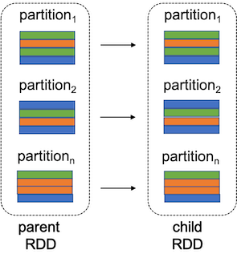

# Spark Transformation and Action: A Deep Dive

A deep dive in Spark transformation and action is essential for writing effective spark code. This article provides a brief overview to Spark transformation and action.

## Table of Contents
  - [Primer](#primer)
  - [Transformations and Actions](#transformations-and-actions)
  - [Lazy and Eager Execution](#lazy-and-eager-execution)
  - [Narrow and Wide Transformation](narrow-and-wide-transformation)
  - [Shuffle Operations](#shuffle-operations)
  - [Stages](#stages)

## Primer

For simplicity, this article focuses on PySpark and DataFrame API. The concepts are applicable similarly to other languages in Spark framework. Furthermore, it is necessary to undersand the following concepts to grasp the rest of the material easily.

Resilient Distributed Dataset: Spark jobs are typically executed against [Resilient Distributed Dataset (RDD)](https://spark.apache.org/docs/3.1.1/rdd-programming-guide.html#resilient-distributed-datasets-rdds), which is fault-tolerant partitions of records that can be concurrently operated. RDDs are immutable, which means each instance of an RDD cannot be altered once it is instantiated.

DataFrame: A Spark data structure conceptually equivalent to a table in a relational database or a [Pandas DataFrame](https://pandas.pydata.org/docs/reference/api/pandas.DataFrame.html), but with richer optimizations under the hood. DataFrames can be constructed from a wide array of sources such as, structured data files, e.g., [`csv`](https://en.wikipedia.org/wiki/Comma-separated_values), [`parquet`](https://en.wikipedia.org/wiki/Apache_Parquet), etc., tables in [Hive](https://en.wikipedia.org/wiki/Apache_Hive), external databases, or existing RDDs. A DataFrame is created and manupulated using [DataFrame API](https://spark.apache.org/docs/latest/api/python/reference/pyspark.sql.html#dataframe-apis). Table 1 represents a sample DataFrame.

<p align="center">

</br>
Table 1: A sample dataframe
</p>

## Transformations and Actions
Common Spark jobs are created using [operations in DataFrame API](https://spark.apache.org/docs/latest/api/python/reference/pyspark.sql.html#dataframe-apis). These operations are either *transformations* or *actions*.

**Transformation**: A Spark operation that reads a DataFrame, manipulates some of the columns, and returns another DataFrame (eventually). Examples of transformation include [`filter`](https://spark.apache.org/docs/latest/api/python/reference/api/pyspark.sql.DataFrame.filter.html#pyspark.sql.DataFrame.filter) and [`select`](https://spark.apache.org/docs/latest/api/python/reference/api/pyspark.sql.DataFrame.select.html#pyspark.sql.DataFrame.select). Figure 2 presents a transformation that creates a DataFrame with a new column `group` using the `age` column of the input DataFrame. 

<p align="center">

</br> 
Figure 2: A Spark transformation that creates a new column named <i>group</i>.
</p>

Action: A spark operation that either returns a result or writes to disc. Examples of action includes [`count`](https://spark.apache.org/docs/latest/api/python/reference/api/pyspark.sql.functions.count.html#pyspark.sql.functions.count) and [`collect`](https://spark.apache.org/docs/latest/api/python/reference/api/pyspark.sql.DataFrame.collect.html#pyspark.sql.DataFrame.collect). Figure 3 presents an action that returns the total number of rows in a DataFrame.

<p align="center">

</br> 
Figure 3: A Spark action that counts the number of rows.
</p>

## Lazy and Eager Execution

Transformations are evaluated in **Lazy** fashion. This means no Spark jobs are triggered, no matter the number of transformations are scheduled. Snippet 1 shows four transformation operations on `people` dataframe, which has not triggered any jobs, but return the expected skeleton of the result. 

```python
> female_in_twenties = people
  .filter(col("gender") = 'female')\
  .filter(col("age") > 20)\
  .filter(col("age") < 30)\
  .drop("id")

> print(female_in_twenties)
DataFrame[name: str, gender: str, age: int]
```
<p align="center"> Snippet 1: Lazy evaluation of transformations </p>

Lazy execution is a common pattern in functional and Big Data languages, e.g., [Spark](https://spark.apache.org/docs/latest/sql-programming-guide.html), [Scala](https://docs.scala-lang.org/getting-started/index.html), [Java Stream API](https://docs.oracle.com/javase/8/docs/api/java/util/stream/Stream.html), etc. Adopting lazy evaluation enables:
- avoiding all data loads at the first step, which is technically impossible with really large datasets
- parallelizing multiple transformations on a single data element using a single thread on a single machine
- applying various optimizations automatically

All actions are executed in an *eager* manner where all unevaluated transformations are executed prior to the action.

## Narrow and Wide Transformation
Transformations are either narrow or wide. 

In a **narrow transformation**, the data required to compute the records in a single partition of the resultant RDD reside in at most one partition of the parent RDD (see Figure 4). Examples of narrow transformation includes [`filter`](https://spark.apache.org/docs/latest/api/python/reference/api/pyspark.sql.DataFrame.filter.html#pyspark.sql.DataFrame.filter), [`drop`](https://spark.apache.org/docs/latest/api/python/reference/api/pyspark.sql.DataFrameNaFunctions.drop.html#pyspark.sql.DataFrameNaFunctions.drop), [`coalesce`](https://spark.apache.org/docs/latest/api/python/reference/api/pyspark.sql.functions.coalesce.html#pyspark.sql.functions.coalesce), etc.

<p align="center">

</br> 
Figure 4: Narrow transformation.
</p>

In a **wide transformation**, the data required to compute the records in a single partition of the resultant RDD may reside in mulitple partitions of the parent RDD (see Figure 5). Examples of wide transformation includes [`distinct`](https://spark.apache.org/docs/latest/api/python/reference/api/pyspark.sql.DataFrame.distinct.html#pyspark.sql.DataFrame.distinct), [`groupBy`](https://spark.apache.org/docs/latest/api/python/reference/api/pyspark.sql.DataFrame.groupBy.html#pyspark.sql.DataFrame.groupBy), [`repartition`](https://spark.apache.org/docs/latest/api/python/reference/api/pyspark.sql.DataFrame.repartition.html#pyspark.sql.DataFrame.repartition), etc.

<p align="center">

</br> 
Figure 5: Wide transformation.
</p>

## Shuffle Operations

A shuffle operation is triggered when data needs to move between executors. It is an essential part of wide transformations, such as [`groupBy`](https://spark.apache.org/docs/latest/api/python/reference/api/pyspark.sql.DataFrame.groupBy.html#pyspark.sql.DataFrame.groupBy), and some actions, such as [`count`](https://spark.apache.org/docs/latest/api/python/reference/api/pyspark.sql.DataFrame.count.html#pyspark.sql.DataFrame.count). 

Figure 5 represents a shuffle operation. Lets assume that it is triggered by a `groupBy` operation. In this case, to group by color, it will serve best if the record of the same color, i.e., green, blue, and orange, are brought together to their respective partitions. If the operation followed by the `groupBy` is a `count`, then it can be easily be calculated by counting the colors in each of the shuffled partitions. 

A shuffle operation has two sub-operations: shuffle-write and shuffle-read, which potentially execute in different executors involved in a shuffle. During shuffle-write, the node convert records in a partition as UnsafeRow--referred to as Tungsten Binary Format. Then it writes that data to the local disk and send across the wire to other executors chosen by the Driver node. During shuffle-read, the node pulls the data partition and copy the data back to RAM. Then it starts executing the next stage transformation and actions.

Transition between stages is a bottleneck for the following reasons:
1. Synchronization delay, since next stage cannot start until every task on all partitions on all nodes in the current stage is completed
2. Disk IO due to shuffle-write and shuffle-read
3. Network IO due to shuffle data transfer

It is, therefore, necessary to design code in such an order that it reduces shuffling as much as possible. 

## Stages

While executing, Spark will break jobs into stages, each containing tasks realizing the operations. In each stage, operations are piplined in such a way that once a single partition of data is read into RAM, Spark will combine as many narrow operations as it can into a single task. Imagine a job illustrated by Snippet 2:

```python
avg_age_by_gender = spark.read.parquet(path)\
  .select("age", "gender")\
  .groupBy("gender")\
  .avg("age")\
  .collect()
```
<p align="center"> Snippet 2: Spark job containing shuffle operation</p>

For the code in Snippet 2, Spark creates the pipeline backwards as follow.

1. collect
2. avg
3. groupBy
4. select
5. read

The benefit of doing it backwards can be explained as follows. While executing the code, the Driver node identifies that in step 3, there is a `groupBy` operation, which converts the pipeline as follows:

1. collect
2. avg
3. GroupBy-2/2
4. shuffle-read
5. shuffle-write
6. groupBy-1/2
7. select
8. read

The steps 1-4 belongs to the first stage and the rest of the steps belongs to the second stage. When the code is executed once, the driver node knows that the output of the shuffle writes are already available to the executors, for a reasonable period of time. If the code is executed more times within that duration, it will execute from the second stage directly, which improve runtime. Furthermore, if caching is used at stage at any transformation operation, it will execute the tasks only after that operation.

## Futher Reading

For more in-depth understanding, checkout the following materials:

1. [RDD Programming Guide](https://spark.apache.org/docs/3.1.1/rdd-programming-guide.html#resilient-distributed-datasets-rdds)
2. [Spark SQL, DataFrames and Datasets Guide](http://spark.apache.org/docs/latest/sql-programming-guide.html)
3. [PySpark Documentation](https://spark.apache.org/docs/latest/api/python/index.html)
4. [Cluster Mode Overview](https://spark.apache.org/docs/latest/cluster-overview.html)
5. [Tuning Spark](https://spark.apache.org/docs/latest/tuning.html)
6. [Deep Dive into Spark SQL’s Catalyst Optimizer](https://databricks.com/blog/2015/04/13/deep-dive-into-spark-sqls-catalyst-optimizer.html)